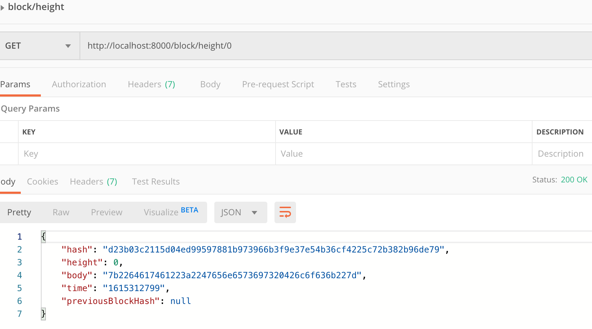
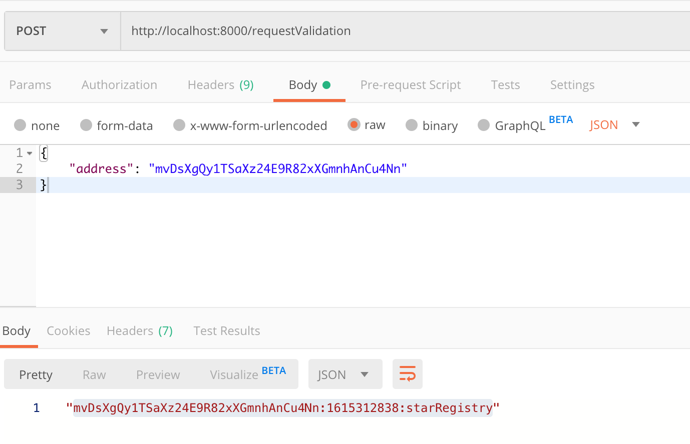
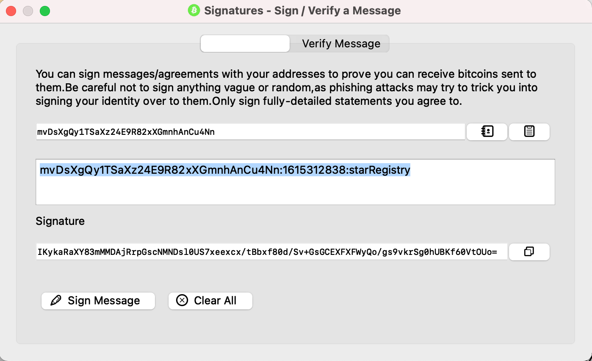
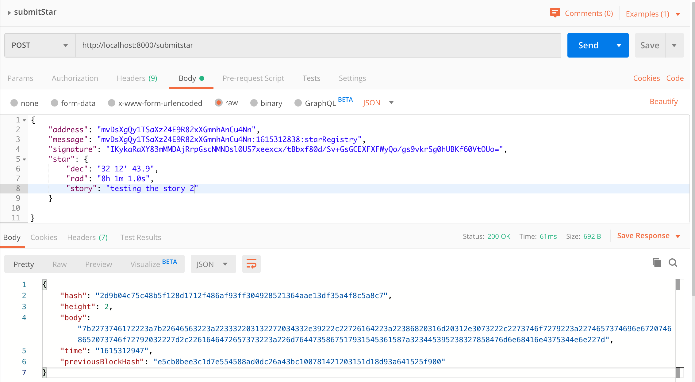
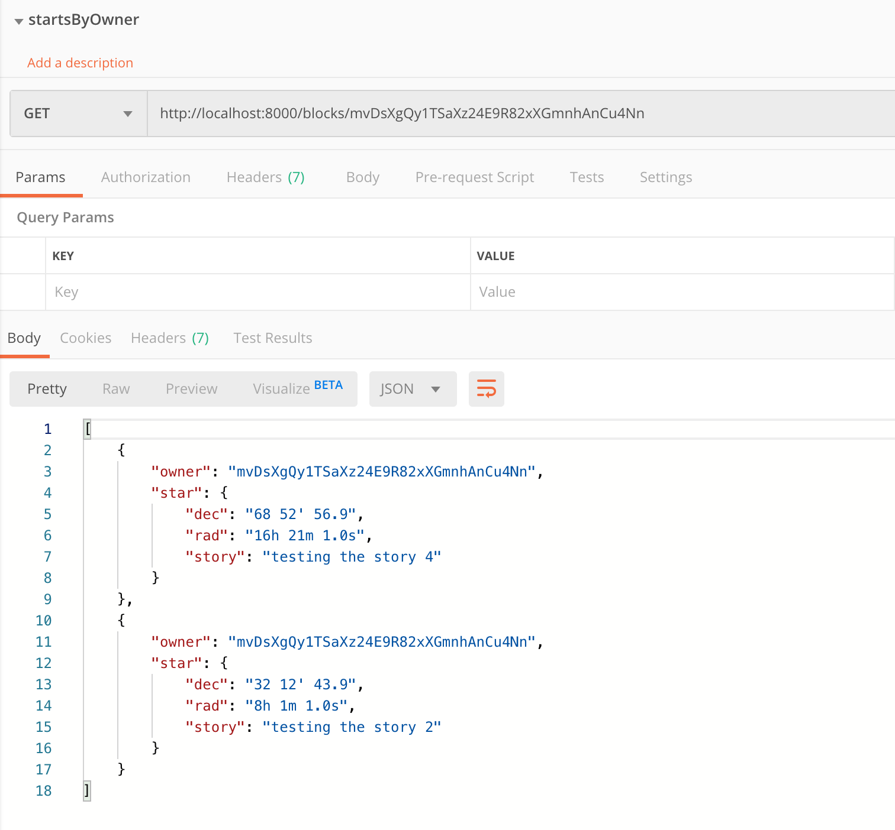
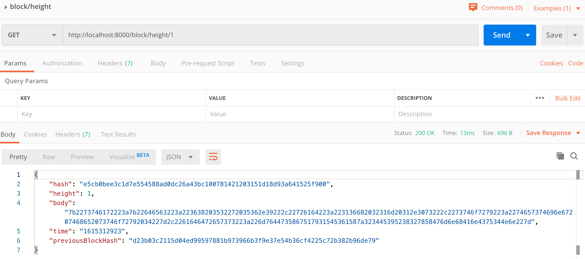

# Private Blockchain Application

> Please check [here](#How-this-project-is-tested) to see how my project is tested locally via postman

## Summary
Someone is trying to make a test of concept on how a Blockchain application can be implemented in his company. He is an astronomy fans and he spend most of his free time on searching stars in the sky, that's why he would like to create a test application that will allows him to register stars, and also some others of his friends can register stars too but making sure the application know who owned each star.

### What is the process to be implemented in the application?

1. The application will create a Genesis Block when we run the application.
2. The user will request the application to send a message to be signed using a Wallet and in this way verify the ownership over the wallet address. The message format will be: `<WALLET_ADRESS>:${new Date().getTime().toString().slice(0,-3)}:starRegistry`;
3. Once the user have the message the user can use a Wallet to sign the message.
4. The user will try to submit the Star object for that it will submit: `wallet address`, `message`, `signature` and the `star` object with the star information.
    The Start information will be formed in this format:
    ```json
        "star": {
            "dec": "68° 52' 56.9",
            "ra": "16h 29m 1.0s",
            "story": "Testing the story 4"
		}
    ```
5. The application will verify if the time elapsed from the request ownership (the time is contained in the message) and the time when you submit the star is less than 5 minutes.
6. If everything is okay the star information will be stored in the block and added to the `chain`
7. The application will allow us to retrieve the Star objects belong to an owner (wallet address).


## What tools or technologies you will use to create this application?

- This application will be created using Node.js and Javascript programming language. The architecture will use ES6 classes because it will help us to organize the code and facilitate the maintnance of the code.
- Some of the libraries or npm modules you will use are:
    - "bitcoinjs-lib": "^4.0.3",
    - "bitcoinjs-message": "^2.0.0",
    - "body-parser": "^1.18.3",
    - "crypto-js": "^3.1.9-1",
    - "express": "^4.16.4",
    - "hex2ascii": "0.0.3",
    - "morgan": "^1.9.1"

Libraries purpose:

1. `bitcoinjs-lib` and `bitcoinjs-message`. Those libraries will help us to verify the wallet address ownership, we are going to use it to verify the signature.
2. `express` The REST Api created for the purpose of this project it is being created using Express.js framework.
3. `body-parser` this library will be used as middleware module for Express and will help us to read the json data submitted in a POST request.
4. `crypto-js` This module contain some of the most important cryotographic methods and will help us to create the block hash.
5. `hex2ascii` This library will help us to **decode** the data saved in the body of a Block.

### Starting the application:

> Clone the repository
```
git clone git@github.com:qiwu7/private-blockchain.git
```

> Then we need to install all the libraries and module dependencies
```
npm install
```

**( Remember to be able to work on this project you will need to have installed in your computer Node.js and npm )**

> Run application
```
node app.js
```

You can check in your terminal the the Express application is listening in the PORT 8000

# How this project is tested

1. To make sure your application is working fine and it creates the Genesis Block you can use POSTMAN to request the Genesis block:
    
2. Make your first request of ownership sending your wallet address:
    
3. Sign the message with your Wallet:
    
4. Submit your Star
     
5. Retrieve Stars owned by me
    
6. Get block at height 1
    